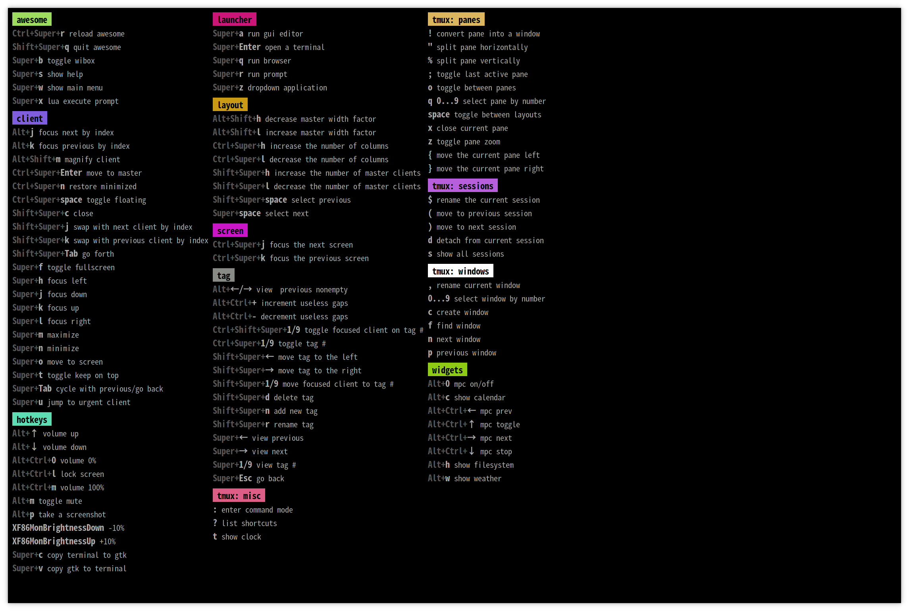

玩玩awesome
<!--more-->

### 前言
kde看多了感觉有点无聊于是就尝试了一下之前一直想玩的平铺式的[windows manager](https://en.wikipedia.org/wiki/Window_manager),之前使用的kde其实是[desktop environment](https://en.wikipedia.org/wiki/Desktop_environment)，它包含了wm,当然还有还有其他的软件，比如文件浏览器，终端模拟器等等一整套东西，而wm只是管理你的窗口，其他东西需要自己装，所以相比于de,它占的资源更少。当然还有一个最重要的用wm的原因就是效率高。效率高体现在它控制窗口用的是快捷键。一般我们正常打开关闭或者最小最大化一个窗口都是鼠标点点，但是它用的是组合键。众所周知，键盘肯定是比鼠标要快的。

### 正文
#### 选择
现在流行的平铺式的窗口管理软件大概有这么几个：i3, dwm, awesome, xmonad. 用这些软件最大的一个问题就是配置，比如xmonad配置就是用haskell这门语言写的，你如果不会。。。也没关系，大概能看懂就行了= =。既然都不会，我就随便选了一个awesome了，它的配置语言是lua，不会配置没关系，抄别人的配置就行了，我用的[这个](https://github.com/lcpz/awesome-copycats)

#### 安装
安装很简单， 装awesome这个软件，然后把上面那个项目的配置文件放入`~/.config/awesome`目录就ok了。它的快捷键是用的`ctrl`，`shift`，`super（win）`，`alt`这四个。

#### 使用

首先最关键的一个快捷键：*super + s*, 显示所有快捷键的列表：

它这个就很清晰了，我这里只罗列一些我平常使用比较多的几个快捷键：
- *super + ctrl + r*  
重载配置，修改了配置以后用这个命令生效。

- *super + r*   
运行一个程序，因为wm没有类似与kde那种dock或者启动器那样的东西，所有它运行软件都要用命令行，用这个就可以调出run prompt然后在里面键入你要运行的命令就可以了。

- *super + enter*  
打开终端。（需要配置自己系统上的终端。）

- *super + n(m)*  
最小最大化一个窗口。

- *super + ctrl + n*  
重新恢复最小化的窗口

- *super + shift + c*  
关闭一个窗口

- *super hjkl*   
使焦点在不同的窗口左下上右移动，用了这个感觉vim使用起来也会更好。

- *alt + shift + hl*  
增加和减少master窗口的宽度。  
这里要说一下master和column的概念：master就是整个屏幕占大部分的那一块，你会在管理器的右下角明显地看出来，column就是多个小的窗口。下面一条显示的每个程序的名字，那个就是client，对应的就是一个窗口（下面说的窗口就是client，懒得截图了，大家理解一下= =。）还有如果master的client是零个的话，用这个快捷键是没用的。

- *ctrl + shift + space*  
在浮动窗口和平铺窗口之间切换。

- *super + space*  
切换窗口管理器的布局。

- *super + f*  
全屏

- *super + b*  
去掉上下的状态栏（我是这么理解= =）

- *super + shift + hl*  
增加和减少master的窗口数量。（对，master的client看上去只有一个其实是可以增加的，也可以为零个client）
还有默认运行的窗口是创建在master里面的。

- *super + ctrl + hl*  
增加和减少column的窗口数量。

- *super + tab*  
切换前一个和后一个窗口。

- *super + shift + jk*
交换上下一个client和当前client的位置。

好差不多了，平常用这么感觉已经够了，还有其他的我也不太清楚，到时候用到再去查。

### 结尾
最后如果你在配置awesome的过程遇到了问题。。。我也不知道。。就google吧（其实上面很多我也是现学的= =
好，就这样！

