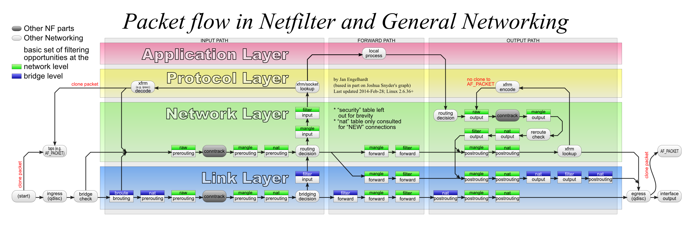

根着[这篇博客](https://tonybai.com/2017/11/06/explain-docker-single-host-network-using-iptables-trace-and-ebtables-log/)，分析了一下docker的单机网络，把一些命令和操作记下来。
<!--more-->

## 开启trace功能

### iptables

trace target只能在raw表中添加：

```bash
iptables -t raw -A OUTPUT -p icmp -j TRACE
iptables -t raw -A PREROUTING -p icmp -j TRACE
```

查看/var/log/messages有没有日志，可能还需要加载一下模块：
`modprobe nf_log_ipv4`

### ebtables

ebtables是一个二层的防火墙。在每一个build-in chain都加上log：

```bash
ebtables -t broute -A BROUTING -p ipv4 --ip-proto 1 --log-level 6 --log-ip --log-prefix "TRACE: eb:broute:BROUTING" -j ACCEPT
ebtables -t nat -A OUTPUT -p ipv4 --ip-proto 1 --log-level 6 --log-ip --log-prefix "TRACE: eb:nat:OUTPUT"  -j ACCEPT
ebtables -t nat -A PREROUTING -p ipv4 --ip-proto 1 --log-level 6 --log-ip --log-prefix "TRACE: eb:nat:PREROUTING" -j ACCEPT
ebtables -t filter -A INPUT -p ipv4 --ip-proto 1 --log-level 6 --log-ip --log-prefix "TRACE: eb:filter:INPUT" -j ACCEPT
ebtables -t filter -A FORWARD -p ipv4 --ip-proto 1 --log-level 6 --log-ip --log-prefix "TRACE: eb:filter:FORWARD" -j ACCEPT
ebtables -t filter -A OUTPUT -p ipv4 --ip-proto 1 --log-level 6 --log-ip --log-prefix "TRACE: eb:filter:OUTPUT" -j ACCEPT
ebtables -t nat -A POSTROUTING -p ipv4 --ip-proto 1 --log-level 6 --log-ip --log-prefix "TRACE: eb:nat:POSTROUTING" -j ACCEPT
```

剩下的就是分析了。


