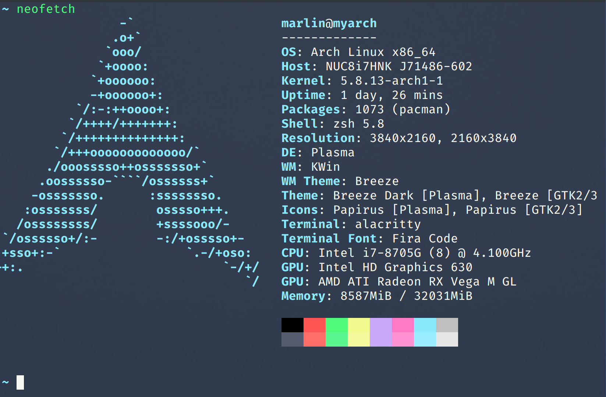
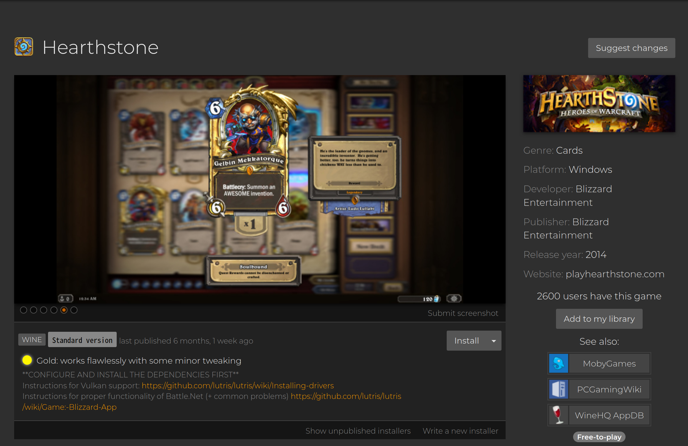
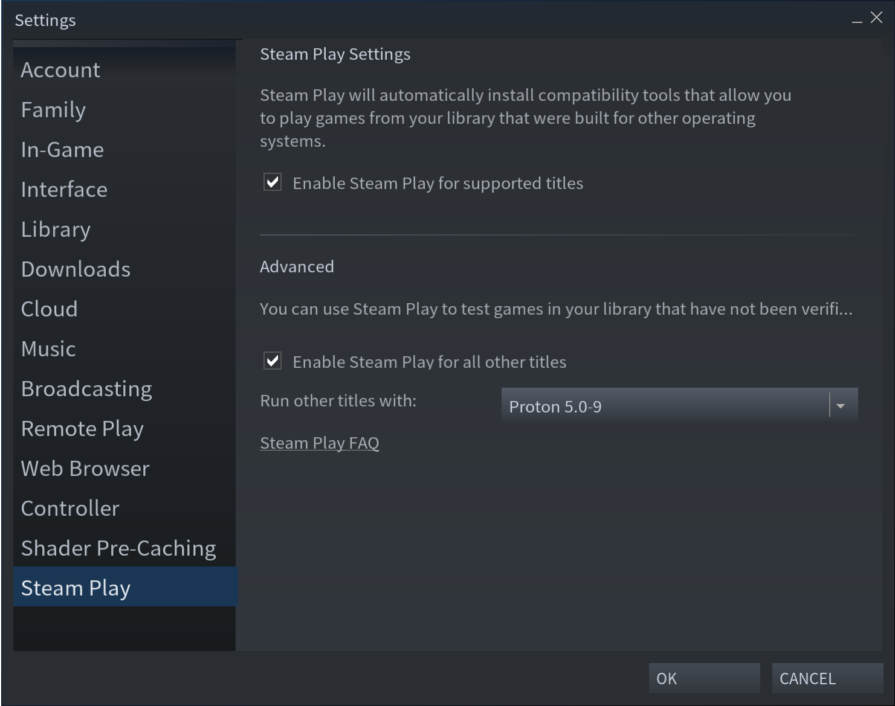
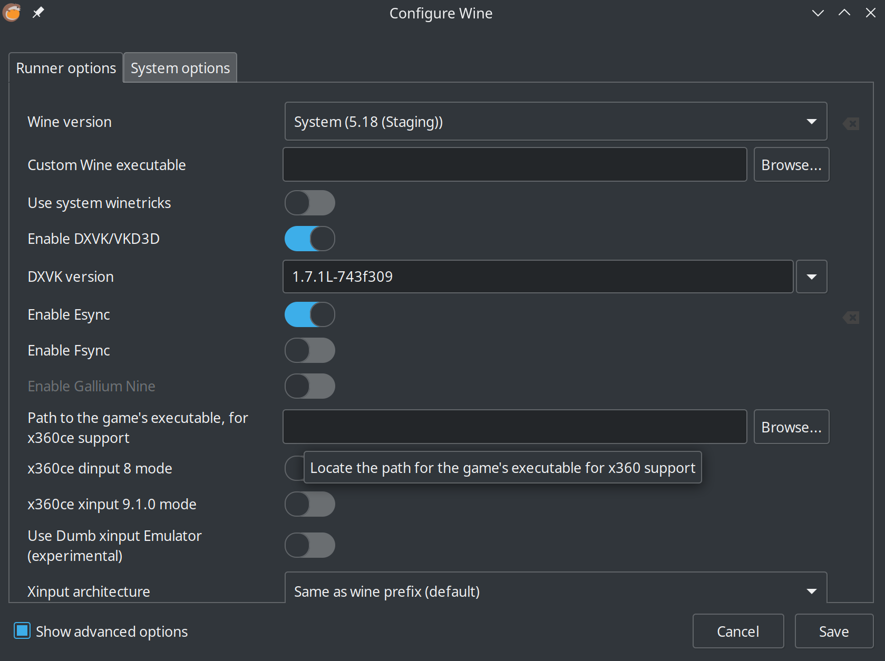
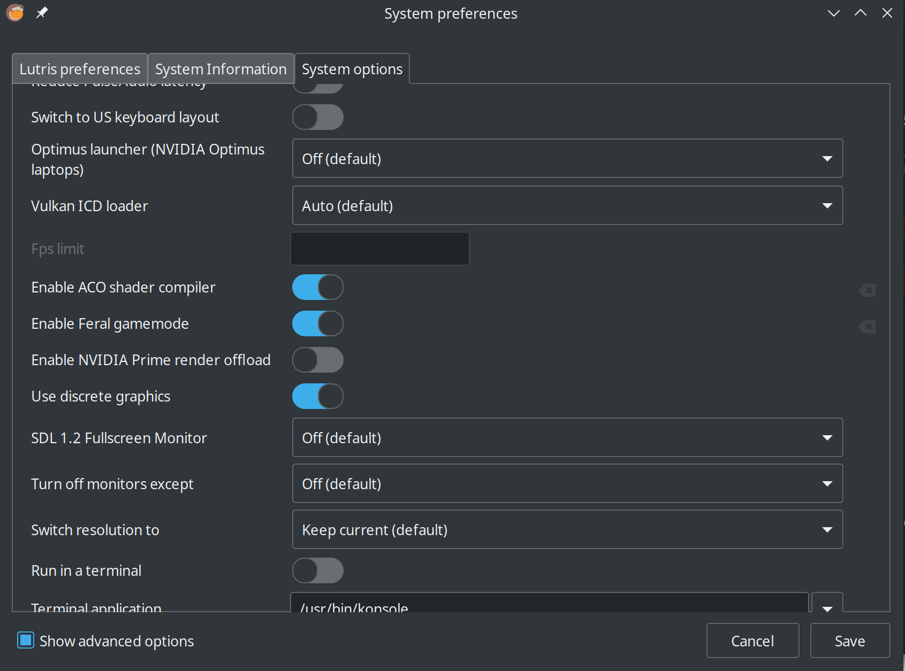
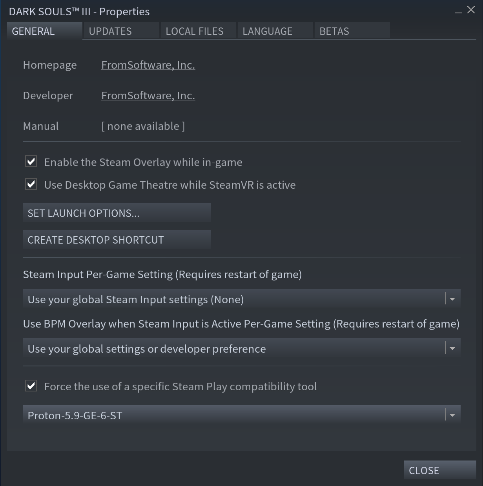
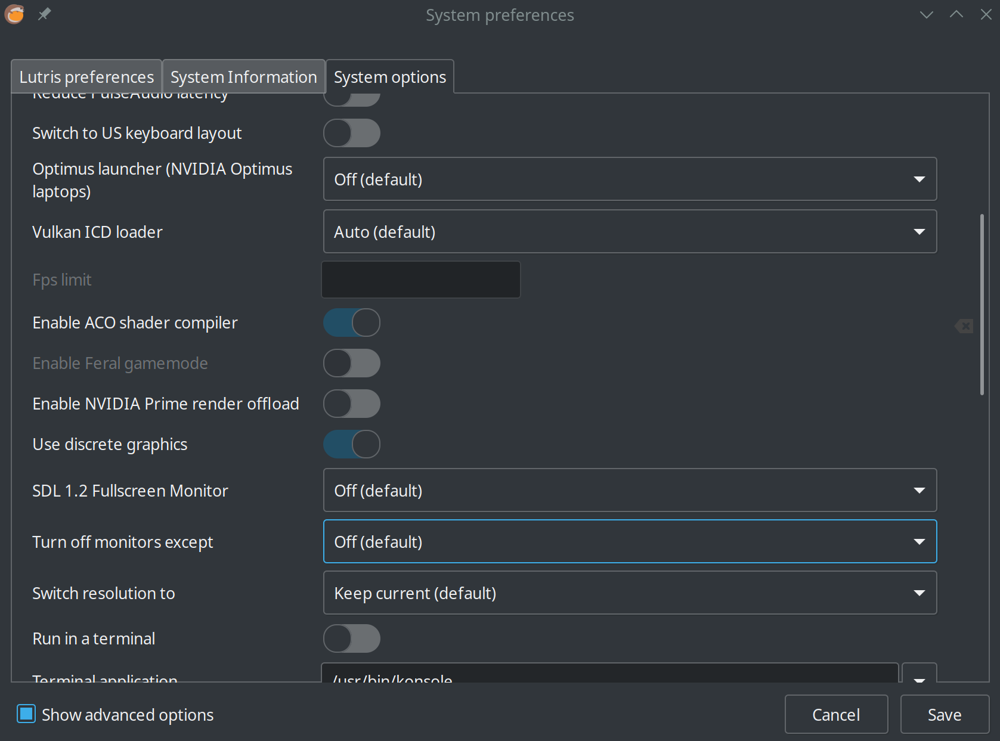
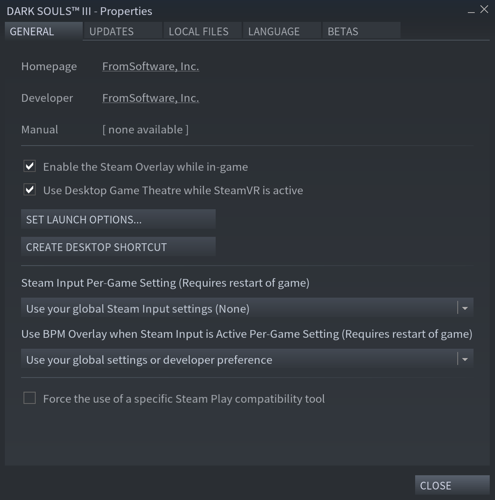

这篇文章主要记录一下在linux下面玩游戏的一些操作及注意的事项，以便之后快速的回顾，我会尽可能把一些细节描述清楚，也能提供其他人在linux玩windows游戏的帮助。

<!--more-->
首先说明一下我的硬件配置:

众所周知，nvidia的显卡驱动对于linux来说是一个大坑，由于我的显卡是amd的，所以可能会比较方便一点，至少到目前为止，我没有遇到显卡驱动方面的坑，但是并不是说nvidia的显卡就不能在linux下面玩游戏了，听说现在装驱动也很方便了，但是我这里就不具体说明了。默认大家都已经装好显卡驱动。

### 准备工作
#### 安装linux版steam
这个应该很简单，各大发行版的包管理应该都能直接安装，这里用arch来说明:
```bash
sudo pacman -S steam
```
直接一条命令。

#### 安装lutris
lutris的具体介绍可能看他们的[官网](https://lutris.net/)，如果你玩steam的游戏可能不需要它，但是如果你要玩其他游戏平台的游戏比如炉石就需要它：

```bash
sudo pacman -S lutirs
```
安装炉石：

[地址](https://lutris.net/games/hearthstone/)

安装的时候可能需要安装其他的一些依赖，比如wine什么的，它可能会提示你有一些依赖没有安装，按照它的步骤来就可以了，如果有依赖没有安装可以参考下面的步骤：  
[安装wine依赖](https://github.com/lutris/docs/blob/master/WineDependencies.md)

#### 关于wine
通俗一点的说，wine就是一个让你在linux下面运行windows软件的一个转换器，所以其实lutris就是把wine封装了一下，如果你不用lutris也可以直接用wine运行windows的游戏，但是这样可能就没有直接用lutris方便，毕竟它集成了一些脚本什么的。

#### 关于proton
proton其实也是一个wine的封装，不过它是valve推出的一个在steam运行windows游戏的工具，可以在steam的设置中启用它：

开启这个设置重启就可以下载非linux原生支持的游戏了。


安装完这些其实就已经基本上可以运行游戏了，下面是一些优化。

#### 启用Esync
启用这个设置可以提高一些依赖cpu的游戏的性能。
查看系统是否已经开启Esync:
```bash
ulimit -Hn
```
如果输出的值大于等于524288,那么已经可以用了，在lutris的wine设置里面可以直接启用：

如果你输出的值小于524288,那么可以按照下面的说明来操作：
[https://github.com/lutris/docs/blob/master/HowToEsync.md](https://github.com/lutris/docs/blob/master/HowToEsync.md)

#### gamemode
GameMode是Linux的守护程序/库组合，它允许游戏请求将一组优化暂时应用到主机OS和/或游戏进程。
具体可以看github介绍：
[https://github.com/FeralInteractive/gamemode](https://github.com/FeralInteractive/gamemode)
arch linux的话直接装就可以了:
```bash
sudo pacman -S gamemode lib32-gamemode
```
在lutris里面开启：


在steam里面开启：
配置游戏的启动参数：
```bash
gamemoderun %command%
```

#### custom proton
这是proton的一个分支，它在proton的基础上又加了一些自定义的配置，某些游戏用它运行可以提升很多性能，至少在我这里运行黑魂3，用默认的proton 5.0-9帧数只有30多，用了custom proton可以提高到40多帧，差不多是30%的性能了。如果用中画质的话就可以流畅运行了, 但是某些游戏性能提升可能就没有那么明显，具体可以到[protondb](https://www.protondb.com/)查看各个游戏的情况。  

下面是custom protom的项目地址：  
[https://github.com/GloriousEggroll/proton-ge-custom](https://github.com/GloriousEggroll/proton-ge-custom)  

如果是arch的话安装就很方便：
```bash
yay -Ss proton-ge-custom
```
其他的发行版安装可能就比较麻烦，要自己编译安装了。

装archcn的包：
```bash
sudp pacman -S proton-ge-custom-stable-bin
```
装完以后可能要注销重新登陆一下电脑。  

然后在steam的游戏设置里面启用custom proton:

在最下面选择，保存设置就可以了。

#### 启用ACO compiler
这个只支持amd的显卡。
ACO compiler是一个由valve开发的开源着色编译器，想较于其他的有更好的性能优势，具体可以看[这篇文章](https://itsfoss.com/linux-games-performance-boost-amd-gpu/)
由于我安装的是mesa-20.1.8-1,ACO compiler默认可用，但是没有开启，所以需要手动开启：  
在lutris里面：
perferences -> system options


在steam里面：
单个游戏的配置里面添加启动参数：
```bash
RADV_PERFTEST=aco %command%
```


### 总结
以上差不多就是我试过的所有关于linux玩windows游戏的所有了。以上的配置也不是说启用了就一定能提高游戏的性能表现，只是一个参考，如果启用了某一项出了问题，完全可以关闭那个配置，或者关闭了那个配置，游戏可能更流畅， = = 。

还有如果安装什么的过程中遇到了问题，可以先google一下，因为你遇到的坑，也许别人早就踩过了。

linux玩游戏就折腾得差不多了，可能还有一些优化的地方，如果遇到以后再来更新了；最后我发现，折腾这东西果然比玩游戏本身有意思多了。-_-