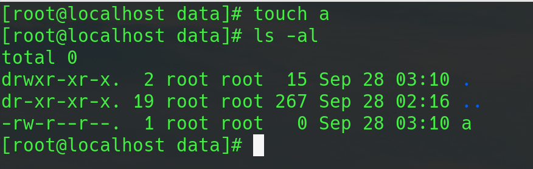
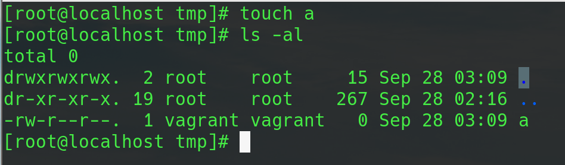

nfs里面的东西还是比较多，这里是关于如何简单快速地起一个nfs服务器。
<!--more-->

服务端和客户端都需要安装nfs-utils这个包。
```bash
yum install nfs-utils -y

systemctl enable rpcbind
systemctl enable nfs
systemctl start rpcbind
systemctl start nfs
```

### 服务端设定
主要配置文件在/etc/exports：
```
/data/nfs *(rw,sync,all_squash,anonuid=1000,anongid=1000)
/data/nfs2 172.27.137.239(rw,async,no_root_squash) *(ro,all_squash)
```
解释一下这几个参数的意思：
前面的目录表示要挂载的目录，“*”表示所有的客户端都可以挂载这个目录，下面的ip是指定某个主机才能挂载；“sync”表示数据会同步写入内存和硬盘，“async”则代表数据会先暂存于内存当中，而非直接写入硬盘（可以节省时间）；“all_squash”表示客户端的用户身份都会被压缩为“nfsnobody”，“anonuid”和“anongid”分别表示需要压缩成对应的用户和组；“no_root_squash”表示开放客户端的root账号使用文件系统，“root_squash”则不能使用root用户，会被压缩成“nfsnobody”。

#### 配置生效
设定好之后，我们导入配置：
```
exportfs -arv

如果要卸载：
exportfs -auv
```
`-r`和`-u`分别表示导入和导出配置，`-a`表示`/etc/exports`里面的所有设定，`-v`是verbose。

#### 查看分享目录
```
showmount -e localhost
```

### 客户端设定
直接挂载：
```
mount -t nfs 172.27.137.240:/data/nfs /tmp
mount -t nfs -o nosuid,noexec,nodev,rsize=32768,wsize=32768,ro 172.27.137.240:/data/nfs2 /data
```
客户端挂载也有很多参数，一般直接用下面这个设定就可以了。特别提醒一下`rsize`和`wsize`这两个参数，分别表示读写的块大小，这两个值可以影响传输的速度，默认为1024(bytes)，如果你是局域网，可以调大，比如改为32768(bytes)
查看挂载：
```
df -h
或者
showmount -e <server ip>
```
卸载:
```
umount /tmp
umount /data
```
下面看一下目录的权限：

这个“vagrant”用户就是前面server端“anonuid=1000”的用户，因为客户端也有这个用户，所以显示为“vagrant”，而且“vagrant”这个用户需要在server端对“/data/nfs”这个目录有相应的权限，要不然也是创建不了文件的。

root用户保持不变。


