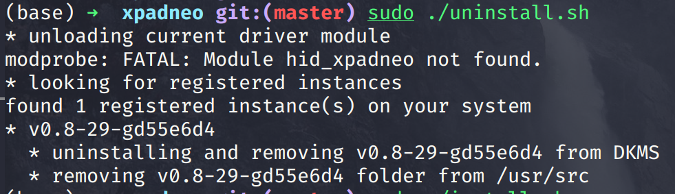
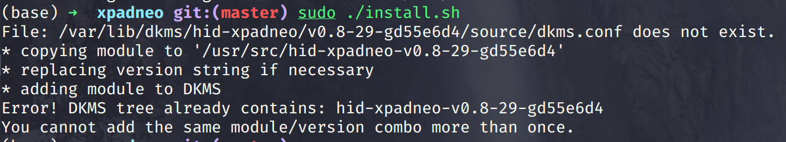
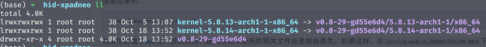

xbox的无线手柄连接linux的蓝牙的时候，会有一个小问题。
<!--more-->

因为linux的蓝牙默认是启用的ertm模式，在这个模式下，xbox的手柄是连接不了的，所以有一个解决办法是关闭这个模式：

### 第一个方法
```sh
sudo echo 1 > /sys/module/bluetooth/parameters/disable_ertm
```
然后重启蓝牙：
```sh
systemctl restart bluebooh
```
但是这个办法电脑重启以后就会失效，每次连接都要来一遍就有点麻烦。

### 第二个方法
还有一个一劳永逸的办法就是安装一个第三方的xbox手柄驱动:
[github](https://github.com/atar-axis/xpadneo)

#### 安装
```sh
arch linux：

sudo pacman -S dkms linux-headers bluez bluez-utils

git clone https://github.com/atar-axis/xpadneo.git

cd xpadneo
sudo ./install.sh
```
装完以后重启配对蓝牙就ok了。可以发现，这个项目还提供了一些手柄的高级操作，有一些甚至在windows下面都不支持。

#### 10月18更新

今天打开steam想用手柄玩会游戏，突然发现手柄不能用了，，之前连上手柄会有轻微的一点震动，现在连上什么反应也没有了，进游戏按键什么的毫无反应。
猜测是系统更新的问题，我就查看了之前装的关于无线蓝牙的驱动和工具：
```sh
sudo pacman -Qs bule
```
发现最近的更新是在9月，那时候我都已经在用这个手柄玩游戏之前了，所以不是这个。

然后我怀疑是手柄的驱动是不是更新了，于是到项目的github发现也没有，最后我尝试重新安装手柄驱动：



原来这个模块没有加载啊，怪不得。但是为什么没有加载呢？

我先没有管，直接重新安装了：



竟然失败了，提示文件不存在！我可没有删除过任何这个目录下的文件啊，查看了文件目录确实没有文件，于是我看了一下install.sh的脚本：
```bash
#!/bin/bash -e

# shellcheck disable=SC1090
source "$(dirname "$0")/lib/installer.sh"

DESTDIR="/usr/src/hid-xpadneo-${VERSION}"

if [[ -z "$INSTALLED" ]]; then

    echo "* copying module to '${DESTDIR}'"
    cp --recursive "hid-xpadneo" "${DESTDIR}"

        echo "* replacing version string if necessary"
        (
                cd "${DESTDIR}"
                sed -i 's/"@DO_NOT_CHANGE@"/"'"${VERSION}"'"/g' dkms.conf src/hid-xpadneo.c
        )

    echo "* adding module to DKMS"
    dkms add "hid-xpadneo/${VERSION}"

    echo "* installing module (using DKMS)"
    dkms install "hid-xpadneo/${VERSION}"

else

    echo "already installed!"

fi
```
脚本很短，先是source了一个installer, 然后看一下`INSTALLED`这个变量为不为空，为空的话就执行安装的步骤。

再看一下那个installer文件：
```bash
#!/bin/bash

if [ ${EUID} -ne 0 ]; then
        echo >&2 "ERROR: You most probably need superuser privileges to use this script, please run me via sudo!"
        exit 3
fi

# shellcheck disable=SC2034
GIT_ROOT=$(git rev-parse --show-toplevel 2>/dev/null || true)

__version() {
        git describe --tags --dirty 2>/dev/null || sed -re's/v?(.*)/v\1/' "$(dirname "${BASH_SOURCE[0]}")/../VERSION"
}

__version_lte() {
    [  "$1" = "$(echo -e "$1\n${2/-/.9999-}" | sort -V | head -n1)" ]
}

# shellcheck disable=SC2034
VERSION=$(__version)

DKMS_BIN=$(type -p dkms)

# shellcheck disable=SC2086
: ${DKMS_BIN:?Please install dkms to continue}

get_dkms_versions_installed() {
        ${DKMS_BIN} status | tr -s ':, ' ' ' | awk -- '$1 == "hid-xpadneo" { print $2 }' | sort -nu
}

get_upstream_version_latest() {
        curl -sI "https://github.com/atar-axis/xpadneo/releases/latest" | \
        awk -- 'BEGIN{IGNORECASE=1} /^location:/ { n = split($2, v, /\//); print v[n]; exit }' | \
        tr -d '[:space:]'
}

# shellcheck disable=SC2034
INSTALLED=(
        $(get_dkms_versions_installed)
)
```
发现是`get_dkms_version_installed`这个函数获取安装版本号：根据`dkms status`的结果提取出版本号，执行了也发现也没啥问题啊。

查看一下dkms究竟是什么：
[arch wiki about DKMS](https://wiki.archlinux.org/index.php/Dynamic_Kernel_Module_Support)
动态内核模块支持(DKMS) 是一个程序框架，可以编译内核代码树之外的模块。0.0 咱不懂啊。但是我看了它几个命令好像也不难。。

问题还是没找到啊，于是我又去错误提示的那个目录看一下究竟少了什么文件：

一看版本好像和我的内核版本不太一样啊！（后面那个5.8.14是我新加的）
看来是更新内核的原因啊，于是我重新生成了一份文件：
```sh
dkms install -m hid-xpadneo -v v0.8-29-gd55e6d4
```
然后重新加载内核模块：
```sh
sudo modprobe hid_xpadneo
lsmod | grep hid_xpadneo
```
重新连接xbox手柄，成功！

虽然写得很短，但是这个问题排查真的花了我一个多小时啊，搞完以后游戏也不想玩了。 关键是内核更新了，这个模块竟然没有更新。。arch wiki里面明明写了：
> 升级内核时，通过 DKMS 管理的内核模块可以被自动重新构建以适应新的内核版本。

问了别人说是内核如果有api break change的时候DKMS是不会自动帮你更新模块的。内核什么的已经超出我的能力范围了 = =。