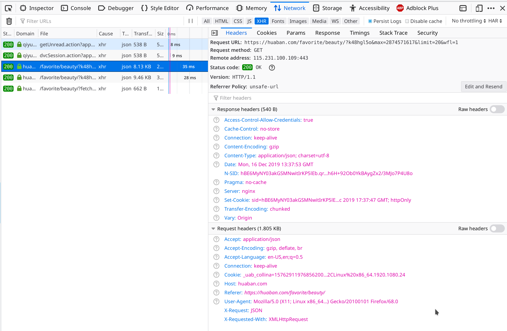

用scrapy和splash爬取花瓣网的图片。代码在：[github](https://github.com/Narlim/picture_spider)
<!--more-->

由于这个网站加载图片是用的[ajax](https://zh.wikipedia.org/wiki/AJAX)请求，不能简单地用scrapy直接爬，通过观察找出它的ajax请求规律：
打开firefox的debugg工具：

选中XHR（[XMLHttpRequest](https://zh.wikipedia.org/wiki/XMLHttpRequest))，它的response是一个json数据，它的请求url为：<https://huaban.com/favorite/beauty/?k457pe8h&max=2839114681&limit=20&wfl=1>，仔细观察会发现这个url会变的只有'max='这个key。而且下一个请求的这个key的值是返回json的'pins'里面的最后一个'pin_id'。
那么就知道它的ajax请求是怎么发起的了，剩下的就是很简单了，只要把这个url构造出来，发请求就好了。

还有一个问题就是上面的headers有两个定制的键值对：'X-Request','X-Requested-With';如果不加那两个，是请求不到json数据的= =。
