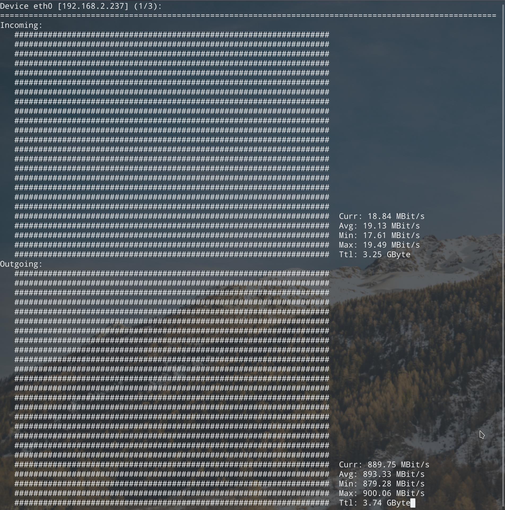
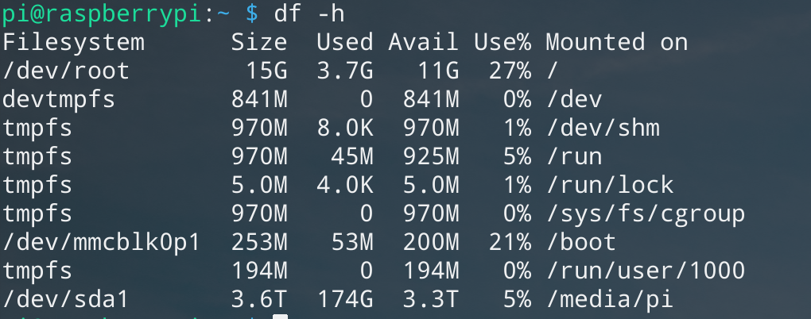
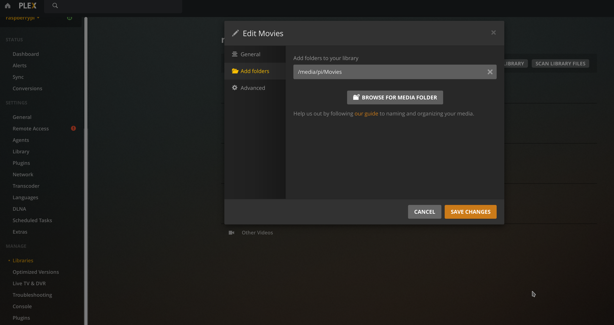

之前用树莓派配置了透明代理，既然树莓派有千兆网口，还有usb3.0，就想着用来做一个简易的NAS吧，然后看到plex的界面还是挺好看的，自动加封面、局域网同步观看进度等一大堆功能，
<!--more-->
usb3.0的理论传输速率是5Gbps，查看一下：

```bash
pi@raspberrypi:~ $ lsusb -t
/:  Bus 02.Port 1: Dev 1, Class=root_hub, Driver=xhci_hcd/4p, 5000M
    |__ Port 2: Dev 2, If 0, Class=Mass Storage, Driver=usb-storage, 5000M
/:  Bus 01.Port 1: Dev 1, Class=root_hub, Driver=xhci_hcd/1p, 480M
    |__ Port 1: Dev 2, If 0, Class=Hub, Driver=hub/4p, 480M
```

关于千兆网口中间还有一个小插曲，就是刚开始我用ssh内网传输文件最大速度大概在11MB/s，就很奇怪，明明是千兆啊，于是我用下面的命令测试了一下：

```bash
在树莓派：
$ nc -l -p 3333 < /dev/zero
然后在我的主机：
$ nc 192.168.2.237 3333 > /dev/null
在pi上用nlaod命令：
$ nload
```

最后发现最大只有百兆，然后我的路由口都是千兆的，主机的网口也是，最后发现是主机的那条网线只支持百兆，于是重新换了一条六类的线。（我以前200兆带宽的时候用的也是那条线啊，干！）

重新测试：


```bash
rsync -av --progress --remove-source-files your_movie.mkv pi:/media/pi/Movies
```

然后内网传输还是在45MB/s = =。不过比之前还是提升了差不多4倍。
> 用dd命令测试磁盘io读写：  
> 读： `$ dd if=tempfile of=/dev/null bs=1M count=1024`(指定磁盘：`$ dd if=/media/pi/tempfile of=/dev/null bs=1M count=1024`)  
> 写： `$ sync; dd if=/dev/zero of=tempfile bs=1M count=1024; sync`（指定磁盘: `$ sync; dd if=/dev/zero of=/media/pi/tempfile bs=1M count=1024; sync`）

### 安装plex

首先下载plex for debian：
[https://www.plex.tv/media-server-downloads/#plex-media-server](https://www.plex.tv/media-server-downloads/#plex-media-server)
选树莓派的架构armv7。

```bash
sudo dpkg -i plexmediaserver_1.16.5.1488-deeb86e7f_amd64.deb

systemctl start plexmediaserver

systemctl enable plexmediaserver
```

然后访问`http://{your_pi_ip}:32400/web`，就可以登录了。可以根据文件夹添加liarary。先要把移动硬盘挂载到树莓派。

### 挂载磁盘

#### 分区

```bash
sudo fdisk -l

找到对应的硬盘, 我这里是/dev/sda

sudo fdisk /dev/sda

先把老的分区删除，然后新建分区。

最后格式化为ext4(我只分了一个区)

sudo mkfs.ext4 /dev/sda1
```

#### 挂载

```bash
sudo mount /dev/sda1 /media/pi

设置开机自动挂载，在/etc/fstab写入一下内容：
/dev/sda1       /media/pi      ext4    defaults  0 0
```
更新：前面的分区信息不是很好，因为这个是变化的，比如你移除了一个硬盘，这个值就变了，所以我们用设备的uuid：
```bash
UUID=226a1c77-a51a-481e-aa2a-4f5e3c13a3bf       /media/pi	ext4		defaults 	0 0
```
后面几个参数的含义就不写了，按照上面的值设定就可以了。

`df -h`查看一下：


然后就可以在这个目录里面新建你的资源目录，比如movie或者tv，最后在plex添加liarary。


大功告成！现在就可以欣赏电影啦！


还有几个小问题：
树莓派对于视频的服务端硬解好像不太行，所以必须要用客户端，也就是播放器来硬件解码，官方也有各种平台的播放器。Windows，ios，macOS等都支持，唯独没有linux。。。如果用网页直接看的话就有点卡。
可以用下面这个appImage：
[https://knapsu.eu/plex/](https://knapsu.eu/plex/)

```bash
下载appImage:
$ chmod +x Plex_Media_Player_20200326_80d5fa29_x64.AppImage

然后直接运行：
./Plex_Media_Player_20200326_80d5fa29_x64.AppImage

如果有qt5的报错，执行：
sudo ln -sf /usr/lib/x86_64-linux-gnu/qt5/plugins/platforms/ /usr/bin/
```


